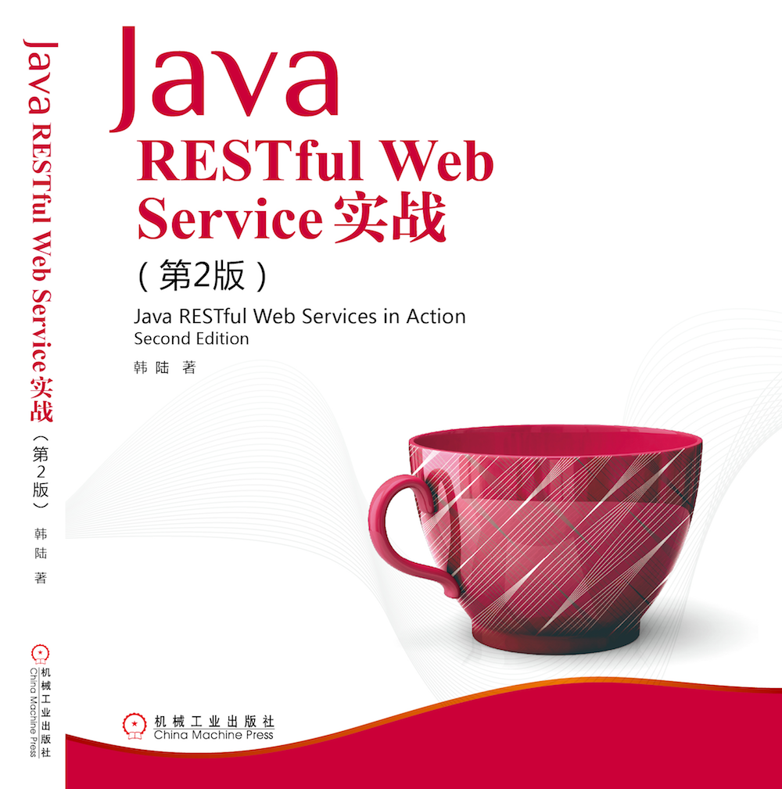

### 《Java Restful Web Service实战·第二版》示例源代码

[**https://github.com/feuyeux/jax-rs2-guide-II**](https://github.com/feuyeux/jax-rs2-guide-II)

1. [1.5.my-first-service](1.5.my-first-service)
1. [1.5.my-first-webapp](1.5.my-first-webapp)
1. [1.6.1.myrest-servlet2-webxml](1.6.1.myrest-servlet2-webxml)
1. [1.6.2.myrest-servlet3-webxml](1.6.2.myrest-servlet3-webxml)
1. [1.6.3.myrest-subservlet](1.6.3.myrest-subservlet)
1. [1.6.4.myrest-servlet3-application](1.6.4.myrest-servlet3-application)
1. [1.6.5.myrest-servlet2-rc](1.6.5.myrest-servlet2-rc)
1. [1.6.6.myrest-servlet2-application](1.6.6.myrest-servlet2-application)
1. [1.6.7.myrest-servlet3-application](1.6.7.myrest-servlet3-application)
1. [2.1.simple-service-3](2.1.simple-service-3)
1. [2.1.simple-service-moxy](2.1.simple-service-moxy)
1. [2.2.simple-service-jackson](2.2.simple-service-jackson)
1. [2.3.6-1.simple-service-moxy](2.3.6-1.simple-service-moxy)
1. [2.3.6-2.simple-service-jsonp](2.3.6-2.simple-service-jsonp)
1. [2.3.6-3.simple-service-jackson](2.3.6-3.simple-service-jackson)
1. [2.3.6-4.simple-service-jettison](2.3.6-4.simple-service-jettison)
1. [2.3.simple-service-jettison](2.3.simple-service-jettison)
1. [2.simple-service-3](2.simple-service-3)
1. [3.jaxrs2-handle](3.jaxrs2-handle)
1. [4.2 JAX-RS2的异步机制](4.2.asynchronized)
1. [4.4 基于HTML5的异步通信](4.4.sse)
1. [5 REST 客户端](5.jaxrs2-client)
1. [6.rest-test](6.rest-test)
1. [7.2 Spring-boot基础](7.2.demo)
1. [7.3.1 Spring Cloud Zookeeper示例](7.3.1.boot.zookeeper)
1. [7.3.2 Spring Cloud Consul示例](7.3.2.boot.consul)
1. [7.3.3 Spring Cloud Etcd示例](7.3.2.boot.etcd)
1. [8.2 REST服务的容器化](8.2.containerization)
1. [8.3 容器化微服务](8.3.boot.zk.kaka)
1. [9.simple-service](9.simple-service)
1. [10.3.security-rest](10.3.security-rest)
1. [10.5.oauth2-rest](10.5.oauth2-rest)

#### 最新Jersey官方文档

[**Jersey User Guide**](https://jersey.java.net/documentation/latest/user-guide.html)

#### Jersey缺陷管理系统

- [**Jersey Jira**](https://java.net/jira/browse/JERSEY/)
- [Jersey版本信息](https://java.net/jira/browse/JERSEY/?selectedTab=com.atlassian.jira.jira-projects-plugin:versions-panel)

#### Jersey问答

[**Jersey StackOverflow**](http://stackoverflow.com/questions/tagged/jersey)

#### Jersey版本发布历史
|版本号|发布日期|发版说明|
|:-------|:----------|:-----------------------------|
|2.23|18/May/16|Jersey 2.23|
|2.22.2|16/Feb/16|[Jersey 2.22.2](https://jersey.java.net/release-notes/2.22.2.html)|
|2.22.1|07/Oct/15|[Jersey 2.22.1](https://jersey.java.net/release-notes/2.22.1.html)|
|2.22|23/Sep/15|[Jersey 2.22](https://jersey.java.net/release-notes/2.22.html)|
|2.21.1|16/Sep/15|[Jersey 2.21.1](https://jersey.java.net/release-notes/2.21.1.html)|
|2.21|15/Aug/15|[Jersey 2.21](https://jersey.java.net/release-notes/2.21.html)|
|2.20|06/Aug/15|[Jersey 2.20](https://jersey.java.net/release-notes/2.20.html)|
|2.19| 29/Jun/15 |[Jersey 2.19](https://jersey.java.net/release-notes/2.19.html)|
|2.18| 05/Jun/15 |[Jersey 2.18](https://jersey.java.net/release-notes/2.18.html)|
| 2.17	 | 11/Mar/15 |[Jersey 2.17](https://jersey.java.net/release-notes/2.17.html)|
| 2.16   | 11/Feb/15 |[Jersey 2.16](https://jersey.java.net/release-notes/2.16.html)|
| 2.15   | 03/Dec/14 |[Jersey 2.15](https://jersey.java.net/release-notes/2.15.html)|
| 2.14   | 01/Oct/14 |[Jersey 2.14](https://jersey.java.net/release-notes/2.14.html)|
| 2.13   | 30/Sep/14 |[Jersey 2.13](https://jersey.java.net/release-notes/2.13.html)|
| 2.12   | 26/Aug/14 |[Jersey 2.12](https://jersey.java.net/release-notes/2.12.html)|
| 2.11   | 23/Jul/14 |[Jersey 2.11](https://jersey.java.net/release-notes/2.11.html)|
| 2.10.1 | 01/Jul/14 |[Jersey 2.10.1](https://jersey.java.net/release-notes/2.10.1.html)|
| 2.10   | 24/Jun/14 |[Jersey 2.10](https://jersey.java.net/release-notes/2.10.html)|
| 2.9.1  | 30/May/14 |[Jersey 2.9.1](https://jersey.java.net/release-notes/2.9.1.html)|
| 2.9    | 23/May/14 |[Jersey 2.9](https://jersey.java.net/release-notes/2.9.html)|
| 2.8    | 29/Apr/14 |[Jersey 2.8](https://jersey.java.net/release-notes/2.8.html)|
| 2.7    | 13/Mar/14 |[Jersey 2.7](https://jersey.java.net/release-notes/2.7.html)|
| 2.6    | 19/Feb/14 |[Jersey 2.6](https://jersey.java.net/release-notes/2.6.html)|
| 2.5.1  | 02/Jan/14 |[Jersey 2.5.1](https://jersey.java.net/release-notes/2.5.1.html)|
| 2.5    | 18/Dec/13 |[Jersey 2.5](https://jersey.java.net/release-notes/2.5.html)|
| 2.4.1  | 08/Nov/13 |[Jersey 2.4.1](https://jersey.java.net/release-notes/2.4.1.html)|
| 2.4    | 25/Oct/13 |[Jersey 2.4](https://jersey.java.net/release-notes/2.4.html)|
| 2.3.1  | 27/Sep/13 |[Jersey 2.3.1](https://jersey.java.net/release-notes/2.3.1.html)|
| 2.3    | 20/Sep/13 |[Jersey 2.3](https://jersey.java.net/release-notes/2.3.html)|
| 2.2    | 14/Aug/13 |[Jersey 2.2](https://jersey.java.net/release-notes/2.2.html)|
| 2.1    | 15/Jul/13 |[Jersey 2.1](https://jersey.java.net/release-notes/2.1.html)|
| 2.0.1  | 03/Jan/14 |[Jersey 2.1](https://jersey.java.net/release-notes/2.0.1.html)|
| 2.0    | 28/May/13 |[Jersey 2.0](https://jersey.java.net/release-notes/2.0.html)|

#### 本书勘误
